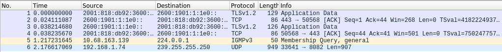
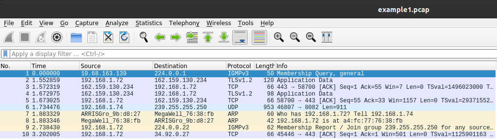
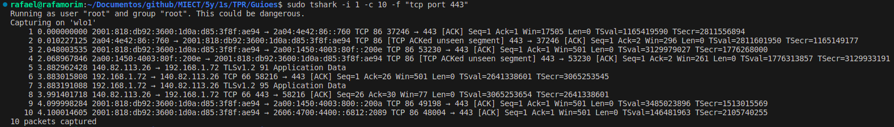
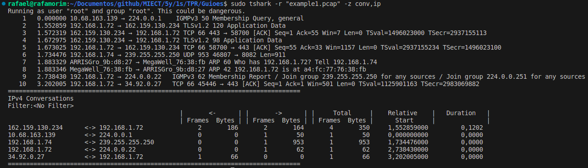

## To use tshark:

- 1º -> Open the terminal in administrator mode.
- 2º -> To discover the network device, type **`tshark -D`** in linux. In Windows, we should first navigate to the wireshark installation path.
- 3º -> Find "wlo1" and note the number associated with the wifi capture device.
- 4º -> Then, enter **`tshark -i 1 -c 15`**
------------------------------------------------------------
-i < interface > || -c < n packet count> stop after n packets (def: infinite) 

------------------------------------------------------------
- 5º -> Alternatively, we can set a stop condition based on duration(s)/filesize(KB)/files/packets by using commands like **`tshark -i 1 -a duration:15`** or **`tshark -w "example2.pcap" -a filesize:1`**. In this example, the capture stops after 15 seconds or after 1kb of size.

------------------------------------------------------------

- 6º -> The promiscuous mode allows the network interface to capture all network traffic on the network segment it is connected to, regardless of the destination of the packets. Normally, network interfaces only capture packets addressed to their own MAC (Media Access Control) address. To do that we type **`tshark -i 1 -a duration:15`**
- 7º -> If we need to save the capture in a file and specify the format using the **-F** parameter (to see all available file formats, run **`tshark -F`**) we can typically use the **-w** parameter. We can accomplish this with the following expression: **`tshark -i 1 -w example1.pcap -F pcap -c 10`**
------------------------------------------------------------
Give the right permissions to write:
**`sudo chmod a+rwx /home/rafael/Documentos/github/MIECT/5y/1s/TPR/Guioes`**

Go to the path and open with sudo:
**`sudo wireshark example1.pcap`**

------------------------------------------------------------

- 8º -> We can filter captures using the **-f** option, specifying conditions such as TCP/UDP/PORTS/...
For example: **`tshark -i 1 -c 10 -f "tcp port 443"`**

------------------------------------------------------------

To read a capture from a file, you simply need to use the command: **`tshark -r "example1.pcap"`**

To convert captures into a table of IP addresses, making more easier to analyze, we can use the command: **`tshark -r "example1.pcap" -z conv,ip`**, -z is used to perform statistics analysis on the capture data.

------------------------------------------------------------